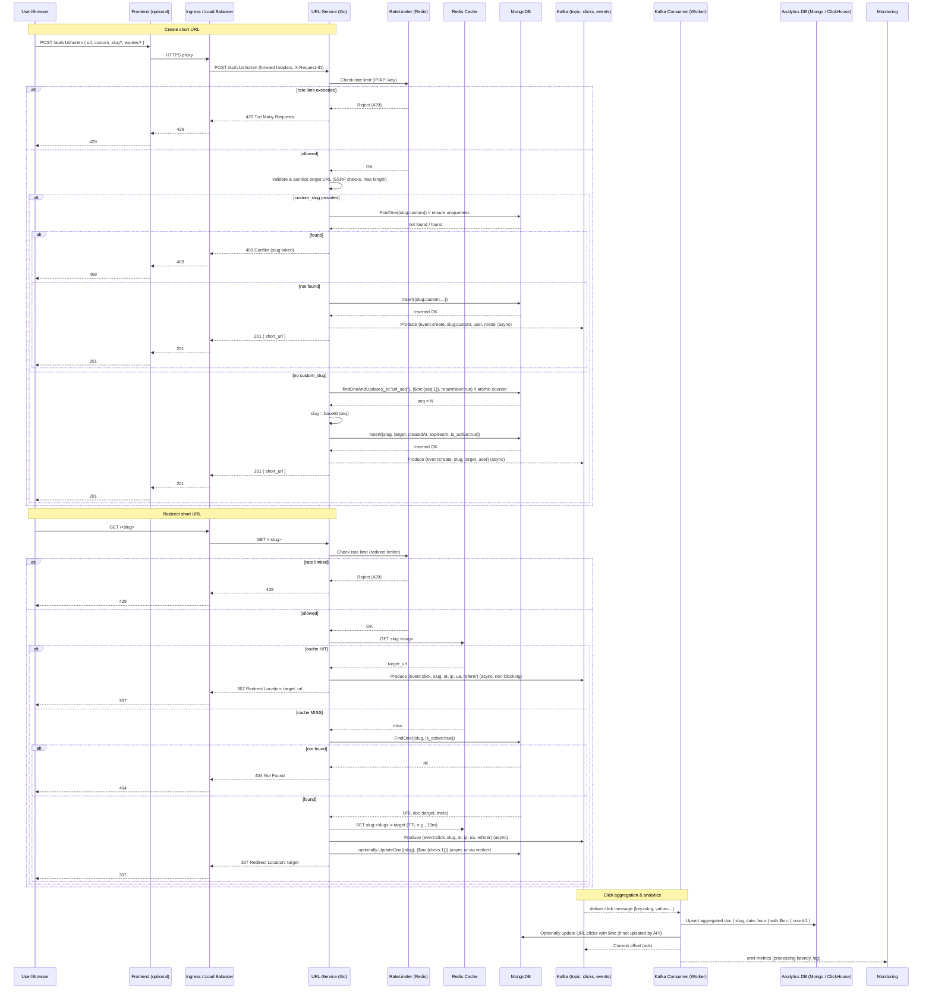

```mermaid
sequenceDiagram
    %% Participants
    participant Client as User/Browser
    participant FE as Frontend (optional)
    participant LB as Ingress / Load Balancer
    participant API as URL-Service (Go)
    participant RL as RateLimiter (Redis)
    participant Cache as Redis Cache
    participant Mongo as MongoDB
    participant Kafka as Kafka (topic: clicks, events)
    participant Worker as Kafka Consumer (Worker)
    participant Analytics as Analytics DB (Mongo / ClickHouse)

    %% ---------------------
    %% 1) CREATE FLOW (POST /api/v1/shorten)
    %% ---------------------
    Note over Client,API: Create short URL
    Client->>FE: POST /api/v1/shorten { url, custom_slug?, expires? }
    FE->>LB: HTTPS proxy
    LB->>API: POST /api/v1/shorten (forward headers, X-Request-ID)
    API->>RL: Check rate limit (IP/API-key)
    alt rate limit exceeded
        RL-->>API: Reject (429)
        API-->>LB: 429 Too Many Requests
        LB-->>FE: 429
        FE-->>Client: 429
    else allowed
        RL-->>API: OK
        API->>API: validate & sanitize target URL (SSRF checks, max length)
        alt custom_slug provided
            API->>Mongo: FindOne({slug:custom})  // ensure uniqueness
            Mongo-->>API: not found / found
            alt found
                API-->>LB: 409 Conflict (slug taken)
                LB-->>FE: 409
                FE-->>Client: 409
            else not found
                API->>Mongo: Insert({slug:custom,...})
                Mongo-->>API: Inserted OK
                API-->>Kafka: Produce {event:create, slug:custom, user, meta} (async)
                API-->>LB: 201 { short_url }
                LB-->>FE: 201
                FE-->>Client: 201
            end
        else no custom_slug
            API->>Mongo: findOneAndUpdate({_id:"url_seq"}, {$inc:{seq:1}}, returnNew:true)  // atomic counter
            Mongo-->>API: seq = N
            API->>API: slug = base62(seq)
            API->>Mongo: Insert({slug, target, createdAt, expiresAt, is_active:true})
            Mongo-->>API: Inserted OK
            API-->>Kafka: Produce {event:create, slug, target, user} (async)
            API-->>LB: 201 { short_url }
            LB-->>FE: 201
            FE-->>Client: 201
        end
    end

    %% ---------------------
    %% 2) REDIRECT FLOW (GET /:slug)
    %% ---------------------
    Note over Client,API: Redirect short URL
    Client->>LB: GET /<slug>
    LB->>API: GET /<slug>
    API->>RL: Check rate limit (redirect limiter)
    alt rate limited
        RL-->>API: Reject (429)
        API-->>LB: 429
        LB-->>Client: 429
    else allowed
        RL-->>API: OK
        API->>Cache: GET slug:<slug>
        alt cache HIT
            Cache-->>API: target_url
            API->>Kafka: Produce {event:click, slug, at, ip, ua, referer} (async, non-blocking)
            API-->>LB: 307 Redirect Location: target_url
            LB-->>Client: 307
        else cache MISS
            Cache-->>API: miss
            API->>Mongo: FindOne({slug, is_active:true})
            alt not found
                Mongo-->>API: nil
                API-->>LB: 404 Not Found
                LB-->>Client: 404
            else found
                Mongo-->>API: URL doc (target, meta)
                API->>Cache: SET slug:<slug> = target (TTL e.g., 10m)
                API->>Kafka: Produce {event:click, slug, at, ip, ua, referer} (async)
                API->>Mongo: optionally UpdateOne({slug}, {$inc:{clicks:1}}) (async or via worker)
                API-->>LB: 307 Redirect Location: target
                LB-->>Client: 307
            end
        end
    end

    %% ---------------------
    %% 3) WORKER / ANALYTICS FLOW (Kafka consumer)
    %% ---------------------
    Note over Kafka,Worker: Click aggregation & analytics
    Kafka-->>Worker: deliver click message (key=slug, value=...)
    Worker->>Analytics: Upsert aggregated doc { slug, date, hour } with $inc: { count:1 }
    Worker->>Mongo: Optionally update URL.clicks with $inc (if not updated by API)
    Worker-->>Kafka: Commit offset (ack)
    Worker-->>Monitoring: emit metrics (processing latency, lag)
```
